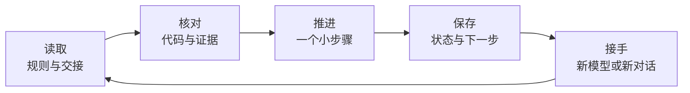

<a name="mem-fix"></a>

<h1 align="center">Mem-Fix</h1>

<p align="center">
  <strong>把项目上下文写进文件，让下一位 AI 能接上。</strong><br>
  跨模型项目记忆 兼 中断恢复
</p>

<p align="center">
  
  
  
</p>

<p align="center">
  <a href="#快速开始">快速开始</a> ·
  <a href="#目录结构与作用">目录结构</a> ·
  <a href="#记忆放在哪里">记忆文件</a> ·
  <a href="#日常使用">换模型接手</a> ·
  <a href="#保存与恢复">保存与恢复</a> ·
  <a href="#文档导航">完整文档</a>
</p>

---

用 AI 写项目，常常写到一半就遇到上下文上限、网络故障、额度限制或模型切换。新对话只收到一句“继续之前的工作”，便可能重新选方案、重复实现，或者把未经验证的代码当成完成品。

**Mem-Fix 是一套跨模型的项目连续性 Skill。** 它把用户要求、已采用的设计决定、进度和验证结果保存到项目文件，让接手的 AI 或开发者先核对事实，再继续工作。

| 你遇到的情况 | Mem-Fix 如何帮助 |
| :--- | :--- |
| 换模型或新对话后，原要求被忘记 | 明确读取项目规则与最新交接，沿用有效约束 |
| 不知道上一次停在哪、哪些已经测过 | 记录工作停点、验证范围和具体下一步 |
| 同一提交上反复修改，旧测试结果被误用 | 绑定工作区状态，关键验证附相关文件指纹 |
| 多个任务互相覆盖记录 | 独立任务 ID、交接文件和检查点编号 |

> [!TIP]
> **小任务只写五项：目标、状态、改动、验证、下一步。**
> 需要时再展开需求与决策，避免把交接变成一份难以维护的长文档。

## 快速开始

根据所用工具选择一种方式。首次建立记录后，后续开发沿用同一套文件。

<details open>
<summary><strong>方式一 · 工具支持 Skill 加载</strong></summary>

按工具的说明导入或放置完整的 `mem-fix` 文件夹。工具支持且已发现 `$mem-fix` 时，发送：

```text
使用 $mem-fix，为当前项目建立连续性记录。
保留已有项目规则，创建或更新工作交接。
当前任务是：填写你要完成的具体任务及验收条件。
建立记录后继续开发，并在检查点保存实际进度。
```

把文件夹放在桌面并不代表工具已经加载了它；首次使用时确认工具能发现并读取 [SKILL.md](SKILL.md)。

</details>

<details>
<summary><strong>方式二 · 工具能读写文件，但没有 Skill 加载机制</strong></summary>

把下面的目录和任务替换为实际值，明确让 AI 读取核心指令：

```text
请读取“Skill目录/SKILL.md”，按 Mem-Fix 流程工作。
目标项目根目录是：“项目根目录”。
当前任务是：填写具体任务及验收条件。

先检查现有规则、相关代码和已有改动。
没有现成交接约定时，保留原有 AGENTS.md 内容并加入连续性区块，
建立 docs/HANDOFF.md，然后继续当前任务。
```

</details>

<details>
<summary><strong>方式三 · 普通聊天模型，没有本地文件能力</strong></summary>

1. 提供 [SKILL.md](SKILL.md) 正文作为指令。
2. 提供项目规则、最新交接和当前任务需要的代码。
3. 让模型输出更新后的完整交接记录，由你保存到项目。
4. 下次对话提供保存后的资料，让新模型接续。

模型输出了记录，不代表已经写入本地文件。材料较多时，优先提供当前任务相关部分，并明确尚未核对的范围。

</details>

**开始前确认：**

- [ ] AI 已读取核心指令，而不只是知道 Skill 名称。
- [ ] 已指明目标项目、当前任务和验收条件。
- [ ] 已确定记录由 AI 写入，还是由你手动保存。

完整提示词见 [首次启动、接手、保存与复核](references/portable-prompts.md)。

## 记忆放在哪里

> [!IMPORTANT]
> **记忆记录默认写入正在开发的项目目录。**
> Skill 文件夹保存指令与模板；实际项目记录在目标项目中创建或更新。

```text
你的项目/
├── AGENTS.md                长期要求、开发规则与约束
└── docs/
    ├── HANDOFF.md           当前任务的正式交接记录
    ├── HANDOFF.md.prev      使用脚本后保留的上一份快照
    └── HANDOFF.md.lock      保存脚本的锁文件
```

| 文件 | 保存什么 | 何时更新 |
| :--- | :--- | :--- |
| `AGENTS.md` | 可追溯的长期要求与项目边界 | 初始化，或要求与约束变化时 |
| `docs/HANDOFF.md` | 当前目标、决策、工作状态、验证与下一步 | 每个有意义的检查点 |
| `docs/HANDOFF.md.prev` | 最近一次被替换的交接快照 | 脚本替换已有正式记录时 |
| `docs/HANDOFF.md.lock` | 保存脚本使用的文件锁载体 | 首次使用保存或恢复脚本时创建，之后保留 |

项目已有规则入口、需求文档或交接路径时优先沿用，并保留现有 `AGENTS.md` 的其他规则。首次保存没有上一份快照；保留的 `.lock` 文件不代表锁仍被占用，不通过删除它来解锁。

## 目录结构与作用

下载或分享时，保留完整的 `mem-fix` 文件夹：

```text
mem-fix/
├── Readme.md                         使用说明
├── SKILL.md                          AI 执行的核心指令
├── agents/
│   └── openai.yaml                   支持工具使用的展示信息
├── assets/
│   ├── AGENTS.block.md               项目规则区块模板
│   ├── HANDOFF.template.md           轻量交接模板
│   └── HANDOFF.extended.md           按需展开的栏目
├── references/
│   ├── portable-prompts.md           跨模型启动和接手提示词
│   ├── checkpoint-storage.md         保存、冲突处理与恢复说明
│   └── verification-state.md         验证与代码状态绑定说明
└── scripts/
    ├── checkpoint.py                 可选保存与指纹工具
    └── tests/
        └── test_checkpoint.py        脚本行为测试
```

### 各部分负责什么

| 目录或文件 | 具体作用 | 谁会使用 |
| :--- | :--- | :--- |
| `Readme.md` | 介绍背景、使用入口、文件位置和操作方法 | 使用者与项目维护者 |
| [SKILL.md](SKILL.md) | 定义接手、要求核对、任务状态、检查点和交接流程 | 执行项目任务的 AI |
| `agents/openai.yaml` | 提供支持工具展示的 Skill 名称和简介，具体读取方式由工具决定 | 支持该元数据的工具 |
| `assets/` | 提供项目规则区块、轻量交接和扩展栏目模板，用来生成目标项目中的记录 | 首次初始化或补齐记录的 AI |
| `references/portable-prompts.md` | 提供首次启动、换模型接手、保存和复核的完整提示词 | 使用者与接手模型 |
| `references/checkpoint-storage.md` | 说明保存、哈希冲突处理、备份恢复和并行任务约定 | 调用保存脚本的 AI 或开发者 |
| `references/verification-state.md` | 定义验证结果与 HEAD、工作区状态、文件指纹的对应方式 | 执行验证或核对旧结果的 AI |
| [scripts/checkpoint.py](scripts/checkpoint.py) | 提供 `inspect`、`save`、`restore` 和 `state` 命令，保护交接保存并生成代码指纹 | 有 Python 执行能力的 AI 或开发者 |
| `scripts/tests/` | 在临时目录验证保存、恢复、并发冲突和进程中断等行为 | 修改脚本的维护者 |

`assets/` 保存的是模板，实际项目的要求和进度写入前面介绍的项目记忆文件。Python 缓存不是必需文件，分享时可以忽略。

## 接续流程



每次接手都从**读取 → 核对 → 推进 → 保存**开始。记录保留可核实的结论、简要依据和不确定项；旧模型没有写下来的思路无法恢复，已有总结也不能替代代码检查。

### 使用条件

| 能力 | 条件 |
| :--- | :--- |
| 阅读与整理交接 | 能理解 Markdown 指令的模型，以及项目资料 |
| AI 自动读写文件 | 工具具备实际项目的文件访问能力与权限 |
| 保存保护与代码指纹 | Python 3.9+ 与命令执行能力，无第三方 Python 包 |
| Git 版本信息 | 项目使用 Git，环境能够执行 Git；无 Git 也可保存交接与文件哈希 |

## 日常使用

### 保存一个检查点

完成小步骤、开始复杂改动、遇到阻塞、改变方案或结束本轮项目工作时，更新发生变化的记录。准备切换模型时，可以直接发送：

```text
请按 Mem-Fix 保存当前检查点。
核对实际改动和验证结果，更新任务状态、检查点编号与下一步。
只整理交接，不额外修改产品代码。
保存后说明正式记录的路径和当前恢复位置。
```

默认约 15 分钟是有可靠时钟时的补充触发条件，在下一个安全停顿点保存。它不提供后台唤醒，也无法保证长工具调用期间或突然断连前完成保存。

### 换模型、新对话或中断后接手

把接手提示词中的文件位置指向实际 Skill 和目标项目：

```text
请按 Mem-Fix 接续这个项目。
先读取 SKILL.md、项目规则和最新交接记录，再核对相关代码、
Git 状态与已有 diff。先确认任务 ID 和状态。

简短说明目标、必须沿用的要求与决定、未完成和未验证内容，
然后在原授权范围内继续下一步，并更新交接记录。
```

突然中断后，检查点之外可能还有修改。接手时同时检查现有文件和未提交改动，再确认真实工作位置。

### 确认任务状态

| 状态 | 接手行为 |
| :--- | :--- |
| 🟢 进行中 | 核实状态后，在原任务范围内继续 |
| 🟡 待确认 | 列明缺少的信息或决定，继续不依赖它的工作 |
| ⏸️ 已暂停 | 按用户明确的恢复指令继续 |
| ✅ 已完成 | 已满足验收并完成必要验证，旧建议不自动变成新任务 |
| ⛔ 已取消 | 不继续旧任务，等待明确的新任务或恢复指令 |

**结束一轮回复不等于任务暂停；代码已修改也不等于已经验证或任务已完成。**

### 控制交接的长度

使用 [轻量模板](assets/HANDOFF.template.md)，默认只写五项。复杂任务再从 [扩展栏目](assets/HANDOFF.extended.md) 选择需求、决策、问题与协作信息。

每份记录保留任务 ID、状态和检查点 ID。每条验证记录执行目录、命令、实际结果、覆盖范围，以及对应的 HEAD 和相关未提交文件状态。没有执行的检查标记未验证。

通常一至两页足够。已有权威资料时引用它们，避免复制后过期；压缩内容时保留有效约束、关键决定和未关闭问题。

## 保存与恢复

> [!NOTE]
> **Python 脚本是可选增强。** 核心文本流程不需要 Python。
> 脚本保护交接文档的保存、生成相关文件指纹；项目代码仍应使用 Git 或其他备份方案保存。

展开所需操作即可。命令中的 `Skill目录`、`项目根目录` 和哈希占位内容需要替换成实际值；路径带空格时保留引号。

<details>
<summary><strong>保存 · 校验候选文件，保留上一份快照</strong></summary>

**1. 读取正式记录，并取得当前哈希。**

```shell
python "Skill目录/scripts/checkpoint.py" inspect "项目根目录/docs/HANDOFF.md"
```

保留返回的 `sha256`；不存在时返回 `missing`。

**2. 把合并后的完整内容写入独立候选文件。**

例如 `docs/HANDOFF.task-a.draft.md`。先核对内容，不直接修改正式记录。

**3. 使用原哈希保存。**

```shell
python "Skill目录/scripts/checkpoint.py" save "项目根目录/docs/HANDOFF.md" --source "项目根目录/docs/HANDOFF.task-a.draft.md" --expect "刚才取得的sha256或missing"
```

脚本校验 UTF-8 Markdown、获取文件锁、核对旧哈希，在同目录写入并校验临时文件，保留上一份快照后替换正式文件，再读取确认。

哈希不符时，重新读取并合并，不能仅更新 `--expect` 后覆盖。命令失败时检查错误信息，不把候选文件当成已经保存的正式记录。

</details>

<details>
<summary><strong>恢复 · 将上一份交接还原为正式记录</strong></summary>

先查看 `.prev`，确认它属于当前任务，并保留仍需参考的较新内容：

```shell
python "Skill目录/scripts/checkpoint.py" inspect "项目根目录/docs/HANDOFF.md.prev"
python "Skill目录/scripts/checkpoint.py" inspect "项目根目录/docs/HANDOFF.md"
python "Skill目录/scripts/checkpoint.py" restore "项目根目录/docs/HANDOFF.md" --expect "正式文件当前的sha256或missing"
```

恢复会替换正式交接文件，保持 `.prev` 不变；随后仍需核对当前项目代码。

完整操作、冲突处理与保护边界见 [保存与恢复说明](references/checkpoint-storage.md)。

</details>

<details>
<summary><strong>指纹 · 区分同一 HEAD 上的不同修改</strong></summary>

关键验证可以对实际相关文件采集指纹：

```shell
python "Skill目录/scripts/checkpoint.py" state --root "项目根目录" --path "src/import.py" --path "tests/test_import.py" --path "pyproject.toml"
```

把示例文件替换成项目实际相关文件，`--path` 可重复。输出包含文件哈希、相关 Git 状态、HEAD 和 `state_id`；无 Git 时仍可生成文件哈希。

关键验证前后使用相同路径集采集。结果不一致时查明变化，视情况重验；指纹相同只说明已采集范围的观察结果一致，不能证明测试成功或整个项目没变。

字段和证据保存方法见 [验证与代码状态](references/verification-state.md)。

</details>

## 多任务并行

各任务独立编号和保存，入口索引由一个协调者维护：

```text
你的项目/docs/
├── HANDOFF.md                  可选入口索引
└── handoffs/
    ├── import-task.md          导入任务的交接
    └── settings-task.md        设置任务的交接
```

共享代码仍需明确归属，必要时采用项目已有的分支或独立工作区方案。独立交接减少记录覆盖，不能消除全部代码编辑冲突。

## 能力边界

| 可以提供的帮助 | 需要留意的范围 |
| :--- | :--- |
| 文件中保留可追溯的上下文 | 接手时必须读取或提供文件，不能保证所有模型百分之百遵守 |
| 保存上一份交接快照 | `.prev` 只保存交接，不能还原项目代码 |
| 校验文本与字节、检测可观察的写入冲突 | 脚本不判断需求、进度和测试结论是否真实 |
| 协调使用同一保存脚本的写入者 | 外部编辑器、网络盘、同步盘与断电行为取决于环境 |
| 记录结论、必要依据和证据位置 | 不保存密钥、令牌、完整聊天或原始敏感输出 |

## 维护与测试

**已记录的验证：** 2026-10-05 · Windows · Python 3.14.7 · **14 项行为测试通过**。

覆盖保存与备份、冲突拒绝、损坏恢复、并发锁、替换前后进程中断，以及同一 HEAD 下的文件内容变化识别。其他操作系统、模型遵守情况和真实项目的完整接手流程仍需结合实际使用检查。

<details>
<summary><strong>运行脚本行为测试</strong></summary>

修改脚本后执行：

```shell
python -B -m unittest discover -s "Skill目录/scripts/tests" -v
```

测试在临时目录运行，相关实现见 [行为测试](scripts/tests/test_checkpoint.py)。

</details>

## 文档导航

| 想做什么 | 阅读哪份文档 |
| :--- | :--- |
| 让 AI 执行完整流程 | [核心指令](SKILL.md) |
| 复制首次启动、接手与保存提示词 | [跨模型提示词](references/portable-prompts.md) |
| 建立或更新项目规则 | [规则区块模板](assets/AGENTS.block.md) |
| 创建精简的工作交接 | [轻量交接模板](assets/HANDOFF.template.md) |
| 增加需求、决策与协作信息 | [交接扩展栏目](assets/HANDOFF.extended.md) |
| 保存、处理冲突或恢复检查点 | [保存与恢复说明](references/checkpoint-storage.md) |
| 精确记录验证对应的代码状态 | [验证与代码状态](references/verification-state.md) |
| 查看可选工具的实现 | [保存与指纹脚本](scripts/checkpoint.py) |

---

[↑ 返回顶部](#mem-fix)
